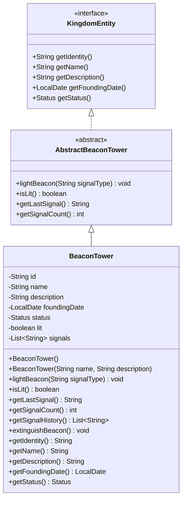

# BeaconTower UML Diagram

## Design Notes

The `BeaconTower` entity represents a communication tower that sends battlefield signals (e.g. "advance", "retreat", "reinforcements", "victory") and tracks its own signal history.

### Design Decisions

- The entity maintains a `List<String>` of sent signals rather than separate `lastSignal`/`signalCount` fields, so both values are always derived from a single source of truth.
- `lightBeacon(String signalType)` trims whitespace and silently ignores null or blank input rather than throwing, keeping the tower's state simple to reason about under bad input.
- `getLastSignal()` and `getSignalCount()` are computed directly from the signal list and marked `@JsonIgnore`, avoiding redundant serialized state alongside the `signals` field.
- `getSignalHistory()` exposes the full signal history as an unmodifiable list, allowing inspection (e.g. for a battle log) without letting callers mutate internal state.
- `extinguishBeacon()` turns the beacon off without clearing its signal history, since "currently lit" and "has sent signals" are independent concerns.
- The implementation focuses only on the responsibilities defined by the contract while keeping the design simple and object-oriented.