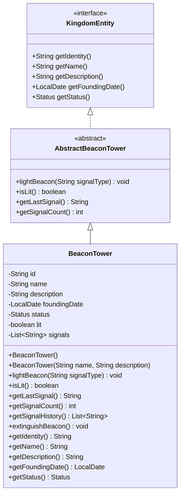

# BeaconTower UML Diagram

```mermaid
classDiagram

class KingdomEntity {
    <<interface>>
    +String getIdentity()
    +String getName()
    +String getDescription()
    +LocalDate getFoundingDate()
    +Status getStatus()
}

class AbstractBeaconTower {
    <<abstract>>
    +lightBeacon(String signalType) void
    +isLit() boolean
    +getLastSignal() String
    +getSignalCount() int
}

class BeaconTower {
    -String id
    -String name
    -String description
    -LocalDate foundingDate
    -Status status
    -boolean lit
    -List~String~ signals

    +BeaconTower()
    +BeaconTower(String name, String description)

    +lightBeacon(String signalType) void
    +isLit() boolean
    +getLastSignal() String
    +getSignalCount() int
    +getSignalHistory() List~String~
    +extinguishBeacon() void

    +getIdentity() String
    +getName() String
    +getDescription() String
    +getFoundingDate() LocalDate
    +getStatus() Status
}

KingdomEntity <|.. AbstractBeaconTower
AbstractBeaconTower <|-- BeaconTower
```