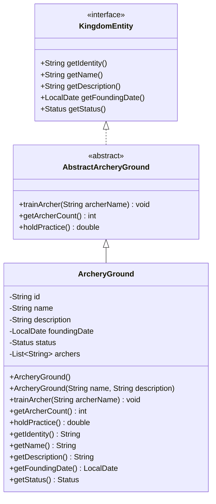

# ArcheryGround UML Diagram

## Design Notes

The `ArcheryGround` entity represents a training facility where named archers are trained and participate in practice sessions.

### Design Decisions

- The entity maintains a `List<String>` of trained archers rather than only an integer count, since the contract trains named archers.
- `trainArcher(String archerName)` validates input, trims whitespace, ignores invalid values, and prevents duplicate entries.
- `getArcherCount()` derives the total number of trained archers directly from the collection, avoiding redundant state.
- `holdPractice()` returns a deterministic accuracy percentage based on the number of trained archers, capped at 100%, making the behavior predictable and easy to test.
- The implementation focuses only on the responsibilities defined by the contract while keeping the design simple and object-oriented.