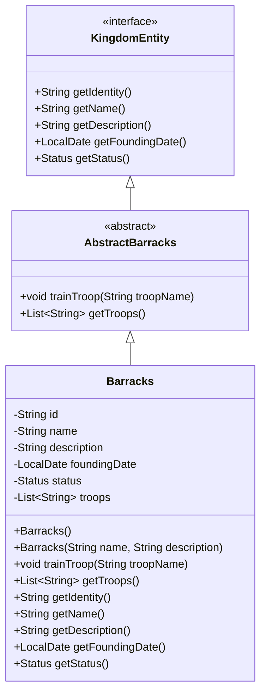

# Market UML Diagram

```mermaid
classDiagram
    class KingdomEntity {
        <<interface>>
        +String getIdentity()
        +String getName()
        +String getDescription()
        +LocalDate getFoundingDate()
        +Status getStatus()
    }
    
    class AbstractBarracks {
        <<abstract>>
        +void trainTroop(String troopName)
        +List~String~ getTroops()
    }
    
    class Barracks {
        -String id
        -String name
        -String description
        -LocalDate foundingDate
        -Status status
        -List~String~ troops
        +Barracks()
        +Barracks(String name, String description)
        +void trainTroop(String troopName)
        +List~String~ getTroops()
        +String getIdentity()
        +String getName()
        +String getDescription()
        +LocalDate getFoundingDate()
        +Status getStatus()
    }
    
    KingdomEntity <|-- AbstractBarracks
    AbstractBarracks <|-- Barracks
```