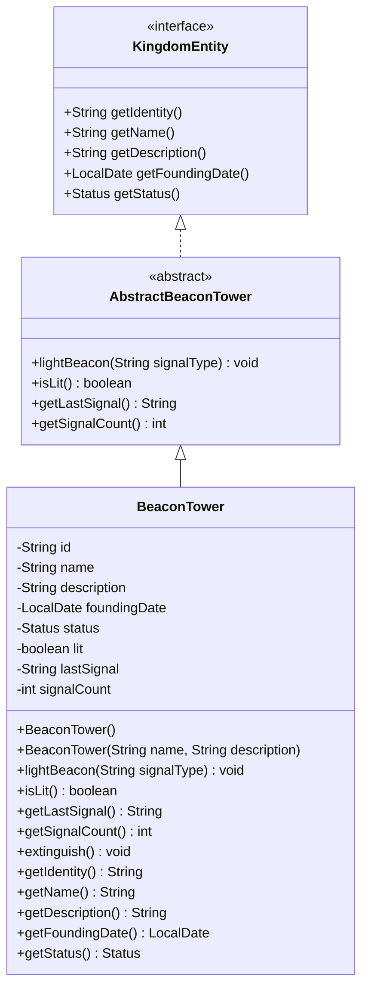

# BeaconTower UML Diagram

## Design Notes

- `BeaconTower` extends `AbstractBeaconTower` and fulfills all required contract methods.
- The entity maintains three pieces of operational state: `lit`, `lastSignal`, and `signalCount`.
- Calling `lightBeacon(String signalType)` lights the beacon, records the signal type, and increments the signal count.
- `isLit()` returns whether the beacon is currently active without modifying state.
- `getLastSignal()` returns the most recent signal type sent from the tower.
- `getSignalCount()` returns the total number of signals sent from this tower.
- The implementation follows the project's OOP conventions while maintaining a simple and focused design.