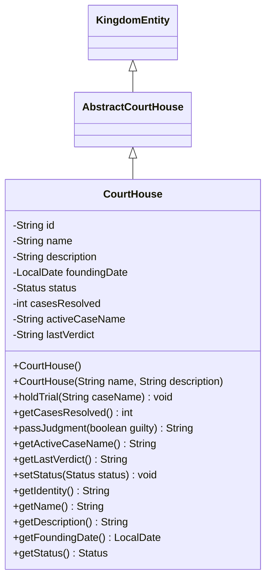

```mermaid
classDiagram

KingdomEntity <|-- AbstractCourtHouse
AbstractCourtHouse <|-- CourtHouse

class CourtHouse {
    -String id
    -String name
    -String description
    -LocalDate foundingDate
    -Status status
    -int casesResolved
    -String activeCaseName
    -String lastVerdict

    +CourtHouse()
    +CourtHouse(String name, String description)

    +holdTrial(String caseName) void
    +getCasesResolved() int
    +passJudgment(boolean guilty) String
    +getActiveCaseName() String
    +getLastVerdict() String
    +setStatus(Status status) void

    +getIdentity() String
    +getName() String
    +getDescription() String
    +getFoundingDate() LocalDate
    +getStatus() Status
}
```
