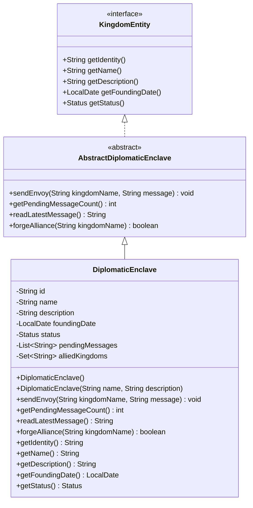

# DiplomaticEnclave UML Diagram

## Design Notes

The `DiplomaticEnclave` entity represents a diplomatic center responsible for managing alliances and diplomatic communications between kingdoms.

### Design Decisions

- The entity maintains a `List<String>` of pending diplomatic messages rather than storing only a message count or latest message.
- `sendEnvoy(String kingdomName, String message)` validates input, trims whitespace, and stores messages in the format `<Kingdom>: <Message>`.
- `getPendingMessageCount()` derives the total number of pending messages directly from the message list, avoiding redundant state.
- `readLatestMessage()` retrieves the most recent diplomatic message and returns an empty string when no messages are available.
- Alliances are stored using a `Set<String>` to ensure uniqueness. `forgeAlliance(String kingdomName)` naturally returns `true` only when a new alliance is successfully established.
- Computed properties are excluded from Jackson serialization using `@JsonIgnore`, preventing redundant serialized data while maintaining a clean object model.