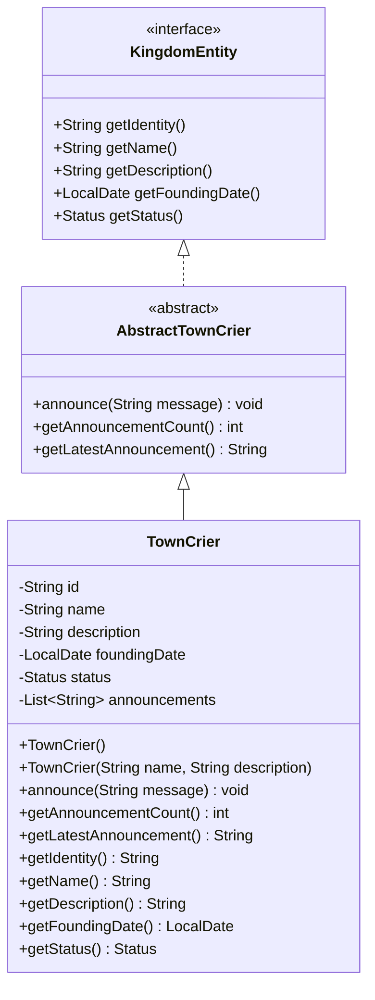

# TownCrier UML Diagram

## Design Notes

The `TownCrier` entity represents a royal messenger responsible for delivering announcements to the citizens of the kingdom.

### Design Decisions

- The entity maintains a `List<String>` of announcements instead of storing only the announcement count or latest announcement.
- `announce(String message)` validates input, trims whitespace, ignores null or blank messages, and allows duplicate announcements since the same message may legitimately be announced multiple times.
- `getAnnouncementCount()` derives the total number of announcements directly from the announcement history, avoiding redundant state.
- `getLatestAnnouncement()` retrieves the most recent announcement from the history and returns an empty string if no announcements have been made.
- Computed properties are excluded from Jackson serialization using `@JsonIgnore`, preventing redundant serialized data while keeping the implementation simple and maintainable.