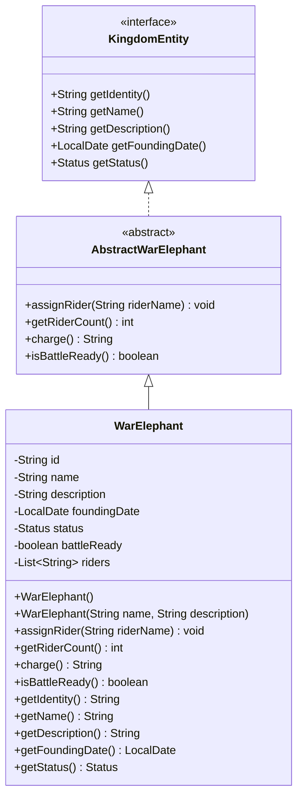

# WarElephant UML Diagram

## Design Notes

The `WarElephant` entity represents a trained battle elephant capable of carrying riders into combat.

### Design Decisions

- The entity maintains a `List<String>` of assigned riders instead of storing only a rider count.
- `assignRider(String riderName)` validates input, trims whitespace, prevents duplicate rider assignments, and marks the elephant as battle-ready once at least one rider has been assigned.
- `getRiderCount()` derives the total number of assigned riders directly from the rider list, avoiding redundant state.
- `charge()` returns a descriptive message based on the elephant's current battle readiness and rider count.
- `isBattleReady()` represents the actual operational state of the elephant and is stored as persistent state.
- Computed properties are excluded from Jackson serialization using `@JsonIgnore`, while the battle readiness state remains serializable.